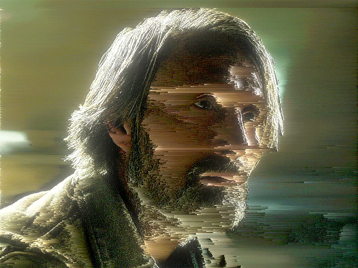
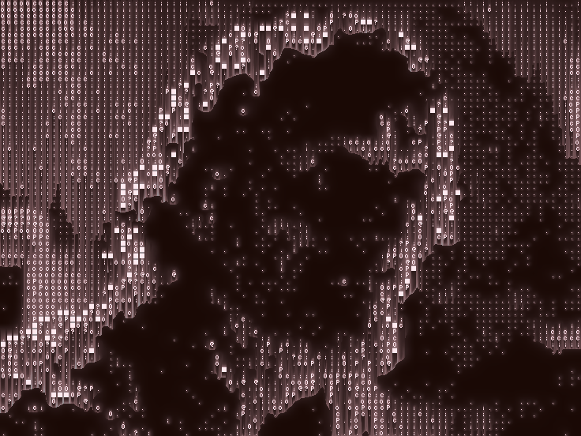
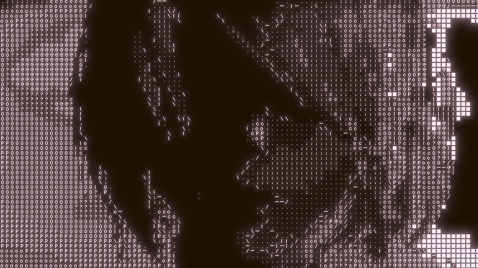

# Artistic Post-Processing Shaders in Unity

(**in progress**)

A collection of custom post-processing effects.

### Pixel sorting

### Combined Kuwahara + Dithering

> my cat Markiz ⬆️

### Bloom (based on Kawase blur)

### Retro (downsampling + dithering + color limiter)

### Ascii

### Ink

### Canny Edge Detection

## Links
- inspired by [Acerola](https://www.youtube.com/@Acerola_t), [Yusef28](https://www.youtube.com/@Yusef28), [Jam2go](https://www.youtube.com/@Jam2go/videos)
- [Canny edge detector](https://en.wikipedia.org/wiki/Canny_edge_detector)
- [Sobel operator](https://en.wikipedia.org/wiki/Sobel_operator)
- [Kernel](https://en.wikipedia.org/wiki/Kernel_(image_processing))
- [Dither](https://en.wikipedia.org/wiki/Dither)
- [Ordered dithering](https://en.wikipedia.org/wiki/Ordered_dithering)
- [Difference of Gaussians by Winnemoeller](https://users.cs.northwestern.edu/~sco590/winnemoeller-cag2012.pdf)
- [Kawase blur](https://github.com/tomc128/urp-kawase-blur)
